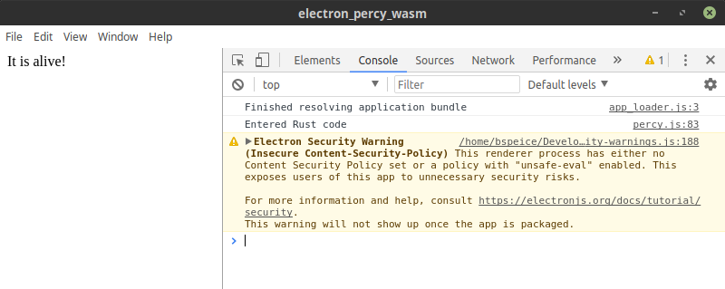
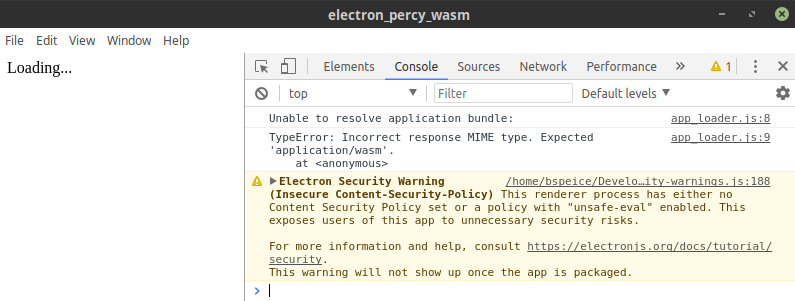

I both despise Javascript and am stunned by its success doing some really cool things. It's
[this duality](https://www.destroyallsoftware.com/talks/the-birth-and-death-of-javascript) that's
led me to a couple of (very) late nights over the past weeks trying to reconcile myself as I
bootstrap a simple desktop application.

<!-- truncate -->

See, as much as
[Webassembly isn't trying to replace Javascript](https://webassembly.org/docs/faq/#is-webassembly-trying-to-replace-javascript),
**I want Javascript gone**. There are plenty of people who don't share my views, and they are
probably nicer and more fun at parties. But I cringe every time "Webpack" is mentioned, and I think
it's hilarious that the
[language specification](https://ecma-international.org/publications/standards/Ecma-402.htm)
dramatically outpaces anyone's
[actual implementation](https://kangax.github.io/compat-table/es2016plus/). The answer to this
conundrum is of course to recompile code from newer versions of the language to older versions _of
the same language_ before running. At least [Babel] is a nice tongue-in-cheek reference.

Yet for as much hate as [Electron] receives, it does a stunningly good job at solving a really hard
problem: _how the hell do I put a button on the screen and react when the user clicks it_? GUI
programming is hard, straight up. But if browsers are already able to run everywhere, why don't we
take advantage of someone else solving the hard problems for us? I don't like that I have to use
Javascript for it, but I really don't feel inclined to whip out good ol' [wxWidgets].

Now there are other native solutions ([libui-rs], [conrod], [oh hey wxWdidgets again!][wxrust]), but
those also have their own issues with distribution, styling, etc. With Electron, I can
`yarn create electron-app my-app` and just get going, knowing that packaging/upgrades/etc. are built
in.

My question is: given recent innovations with WASM, _are we Electron yet_?

No, not really.

Instead, **what would it take to get to a point where we can skip Javascript in Electron apps?**

# Setting the Stage

Truth is, WASM/Webassembly is a pretty new technology and I'm a total beginner in this area. There
may already be solutions to the issues I discuss, but I'm totally unaware of them, so I'm going to
try and organize what I did manage to discover.

I should also mention that the content and things I'm talking about here are not intended to be
prescriptive, but more "if someone else is interested, what do we already know doesn't work?" _I
expect everything in this post to be obsolete within two months._ Even over the course of writing
this, [a separate blog post](https://mnt.io/2018/08/28/from-rust-to-beyond-the-asm-js-galaxy/) had
to be modified because [upstream changes](https://github.com/WebAssembly/binaryen/pull/1642) broke a
[Rust tool](https://github.com/rustwasm/wasm-bindgen/pull/787) the post tried to use. The post
ultimately
[got updated](https://mnt.io/2018/08/28/from-rust-to-beyond-the-asm-js-galaxy/#comment-477), **but
all this happened within the span of a week.** Things are moving quickly.

I'll also note that we're going to skip [asm.js] and [emscripten]. Truth be told, I couldn't get
either of these to output anything, and so I'm just going to say
[here be dragons.](https://en.wikipedia.org/wiki/Here_be_dragons) Everything I'm discussing here
uses the `wasm32-unknown-unknown` target.

The code that I _did_ get running is available
[over here](https://github.com/speice-io/isomorphic-rust). Feel free to use it as a starting point,
but I'm mostly including the link as a reference for the things that were attempted.

# An Example Running Application

So, I did _technically_ get a running application:



...which you can also try out if you want:

```sh
git clone https://github.com/speice-io/isomorphic-rust.git
cd isomorphic_rust/percy
yarn install && yarn start
```

...but I wouldn't really call it a "high quality" starting point to base future work on. It's mostly
there to prove this is possible in the first place. And that's something to be proud of! There's a
huge amount of engineering that went into showing a window with the text "It's alive!".

There's also a lot of usability issues that prevent me from recommending anyone try Electron and
WASM apps at the moment, and I think that's the more important thing to discuss.

# Issue the First: Complicated Toolchains

I quickly established that [wasm-bindgen] was necessary to "link" my Rust code to Javascript. At
that point you've got an Electron app that starts an HTML page which ultimately fetches your WASM
blob. To keep things simple, the goal was to package everything using [webpack] so that I could just
load a `bundle.js` file on the page. That decision was to be the last thing that kinda worked in
this process.

The first issue
[I ran into](https://www.reddit.com/r/rust/comments/98lpun/unable_to_load_wasm_for_electron_application/)
while attempting to bundle everything via `webpack` is a detail in the WASM spec:

> This function accepts a Response object, or a promise for one, and ... **[if > it] does not match
> the `application/wasm` MIME type**, the returned promise will be rejected with a TypeError;
>
> [WebAssembly - Additional Web Embedding API](https://webassembly.org/docs/web/#additional-web-embedding-api)

Specifically, if you try and load a WASM blob without the MIME type set, you'll get an error. On the
web this isn't a huge issue, as the server can set MIME types when delivering the blob. With
Electron, you're resolving things with a `file://` URL and thus can't control the MIME type:



There are a couple of solutions depending on how far into the deep end you care to venture:

- Embed a static file server in your Electron application
- Use a [custom protocol](https://electronjs.org/docs/api/protocol) and custom protocol handler
- Host your WASM blob on a website that you resolve at runtime

But all these are pretty bad solutions and defeat the purpose of using WASM in the first place.
Instead, my workaround was to
[open a PR with `webpack`](https://github.com/webpack/webpack/issues/7918) and use regex to remove
calls to `instantiateStreaming` in the
[build script](https://github.com/speice-io/isomorphic-rust/blob/master/percy/build.sh#L21-L25):

```sh
cargo +nightly build --target=wasm32-unknown-unknown && \
    wasm-bindgen "$WASM_DIR/debug/$WASM_NAME.wasm" --out-dir "$APP_DIR" --no-typescript && \
    # Have to use --mode=development so we can patch out the call to instantiateStreaming
    "$DIR/node_modules/webpack-cli/bin/cli.js" --mode=development "$APP_DIR/app_loader.js" -o "$APP_DIR/bundle.js" && \
    sed -i 's/.*instantiateStreaming.*//g' "$APP_DIR/bundle.js"
```

Once that lands, the
[build process](https://github.com/speice-io/isomorphic-rust/blob/master/percy_patched_webpack/build.sh#L24-L27)
becomes much simpler:

```sh

cargo +nightly build --target=wasm32-unknown-unknown && \
    wasm-bindgen "$WASM_DIR/debug/$WASM_NAME.wasm" --out-dir "$APP_DIR" --no-typescript && \
    "$DIR/node_modules/webpack-cli/bin/cli.js" --mode=production "$APP_DIR/app_loader.js" -o "$APP_DIR/bundle.js"
```

But we're not done yet! After we compile Rust into WASM and link WASM to Javascript (via
`wasm-bindgen` and `webpack`), we still have to make an Electron app. For this purpose I used a
starter app from [Electron Forge], and then a
[`prestart` script](https://github.com/speice-io/isomorphic-rust/blob/master/percy/package.json#L8)
to actually handle starting the application.

The
[final toolchain](https://github.com/speice-io/isomorphic-rust/blob/master/percy/package.json#L8)
looks something like this:

- `yarn start` triggers the `prestart` script
- `prestart` checks for missing tools (`wasm-bindgen-cli`, etc.) and then:
  - Uses `cargo` to compile the Rust code into WASM
  - Uses `wasm-bindgen` to link the WASM blob into a Javascript file with exported symbols
  - Uses `webpack` to bundle the page start script with the Javascript we just generated
    - Uses `babel` under the hood to compile the `wasm-bindgen` code down from ES6 into something
      browser-compatible
- The `start` script runs an Electron Forge handler to do some sanity checks
- Electron actually starts

...which is complicated. I think more work needs to be done to either build a high-quality starter
app that can manage these steps, or another tool that "just handles" the complexity of linking a
compiled WASM file into something the Electron browser can run.

# Issue the Second: WASM tools in Rust

For as much as I didn't enjoy the Javascript tooling needed to interface with Rust, the Rust-only
bits aren't any better at the moment. I get it, a lot of projects are just starting off, and that
leads to a fragmented ecosystem. Here's what I can recommend as a starting point:

Don't check in your `Cargo.lock` files to version control. If there's a disagreement between the
version of `wasm-bindgen-cli` you have installed and the `wasm-bindgen` you're compiling with in
`Cargo.lock`, you get a nasty error:

```
it looks like the Rust project used to create this wasm file was linked against
a different version of wasm-bindgen than this binary:

rust wasm file: 0.2.21
    this binary: 0.2.17

Currently the bindgen format is unstable enough that these two version must
exactly match, so it's required that these two version are kept in sync by
either updating the wasm-bindgen dependency or this binary.
```

Not that I ever managed to run into this myself (_coughs nervously_).

There are two projects attempting to be "application frameworks": [percy] and [yew]. Between those,
I managed to get [two](https://github.com/speice-io/isomorphic-rust/tree/master/percy)
[examples](https://github.com/speice-io/isomorphic-rust/tree/master/percy_patched_webpack) running
using `percy`, but was unable to get an
[example](https://github.com/speice-io/isomorphic-rust/tree/master/yew) running with `yew` because
of issues with "missing modules" during the `webpack` step:

```sh
ERROR in ./dist/electron_yew_wasm_bg.wasm
Module not found: Error: Can't resolve 'env' in '/home/bspeice/Development/isomorphic_rust/yew/dist'
 @ ./dist/electron_yew_wasm_bg.wasm
 @ ./dist/electron_yew_wasm.js
 @ ./dist/app.js
 @ ./dist/app_loader.js
```

If you want to work with the browser APIs directly, your choices are [percy-webapis] or [stdweb] (or
eventually [web-sys]). See above for my `percy` examples, but when I tried
[an example with `stdweb`](https://github.com/speice-io/isomorphic-rust/tree/master/stdweb), I was
unable to get it running:

```sh
ERROR in ./dist/stdweb_electron_bg.wasm
Module not found: Error: Can't resolve 'env' in '/home/bspeice/Development/isomorphic_rust/stdweb/dist'
 @ ./dist/stdweb_electron_bg.wasm
 @ ./dist/stdweb_electron.js
 @ ./dist/app_loader.js
```

At this point I'm pretty convinced that `stdweb` is causing issues for `yew` as well, but can't
prove it.

I did also get a [minimal example](https://github.com/speice-io/isomorphic-rust/tree/master/minimal)
running that doesn't depend on any tools besides `wasm-bindgen`. However, it requires manually
writing "`extern C`" blocks for everything you need from the browser. Es no bueno.

Finally, from a tools and platform view, there are two up-and-coming packages that should be
mentioned: [js-sys] and [web-sys]. Their purpose is to be fundamental building blocks that exposes
the browser's APIs to Rust. If you're interested in building an app framework from scratch, these
should give you the most flexibility. I didn't touch either in my research, though I expect them to
be essential long-term.

So there's a lot in play from the Rust side of things, and it's just going to take some time to
figure out what works and what doesn't.

# Issue the Third: Known Unknowns

Alright, so after I managed to get an application started, I stopped there. It was a good deal of
effort to chain together even a proof of concept, and at this point I'd rather learn [Typescript]
than keep trying to maintain an incredibly brittle pipeline. Blasphemy, I know...

The important point I want to make is that there's a lot unknown about how any of this holds up
outside proofs of concept. Things I didn't attempt:

- Testing
- Packaging
- Updates
- Literally anything related to why I wanted to use Electron in the first place

# What it Would Take

Much as I don't like Javascript, the tools are too shaky for me to recommend mixing Electron and
WASM at the moment. There's a lot of innovation happening, so who knows? Someone might have an
application in production a couple months from now. But at the moment, I'm personally going to stay
away.

Let's finish with a wishlist then - here are the things that I think need to happen before
Electron/WASM/Rust can become a thing:

- Webpack still needs some updates. The necessary work is in progress, but hasn't landed yet
  ([#7983](https://github.com/webpack/webpack/pull/7983))
- Browser API libraries (`web-sys` and `stdweb`) need to make sure they can support running in
  Electron (see module error above)
- Projects need to stabilize. There's talk of `stdweb` being turned into a Rust API
  [on top of web-sys](https://github.com/rustwasm/team/issues/226#issuecomment-418475778), and percy
  [moving to web-sys](https://github.com/chinedufn/percy/issues/24), both of which are big changes
- `wasm-bindgen` is great, but still in the "move fast and break things" phase
- A good "boilerplate" app would dramatically simplify the start-up costs;
  [electron-react-boilerplate](https://github.com/chentsulin/electron-react-boilerplate) comes to
  mind as a good project to imitate
- More blog posts/contributors! I think Electron + Rust could be cool, but I have no idea what I'm
  doing

[wxwidgets]: https://wxwidgets.org/
[libui-rs]: https://github.com/LeoTindall/libui-rs/
[electron]: https://electronjs.org/
[babel]: https://babeljs.io/
[wxrust]: https://github.com/kenz-gelsoft/wxRust
[wasm-bindgen]: https://github.com/rustwasm/wasm-bindgen
[js-sys]: https://crates.io/crates/js-sys
[percy-webapis]: https://crates.io/crates/percy-webapis
[stdweb]: https://crates.io/crates/stdweb
[web-sys]: https://crates.io/crates/web-sys
[percy]: https://chinedufn.github.io/percy/
[virtual-dom-rs]: https://crates.io/crates/virtual-dom-rs
[yew]: https://github.com/DenisKolodin/yew
[react]: https://reactjs.org/
[elm]: http://elm-lang.org/
[asm.js]: http://asmjs.org/
[emscripten]: https://kripken.github.io/emscripten-site/
[typescript]: https://www.typescriptlang.org/
[electron forge]: https://electronforge.io/
[conrod]: https://github.com/PistonDevelopers/conrod
[webpack]: https://webpack.js.org/
