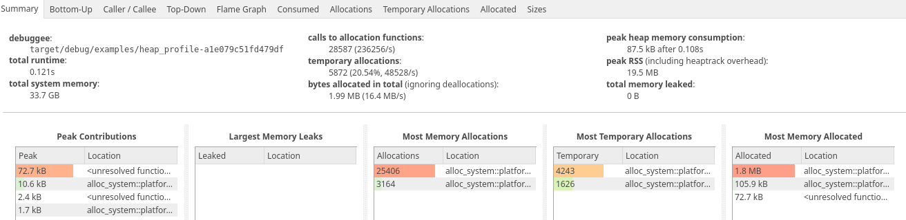
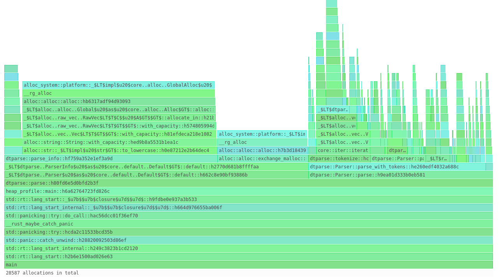
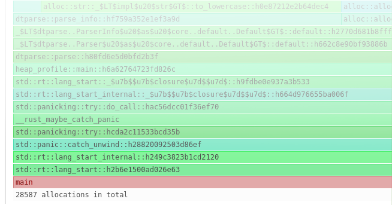
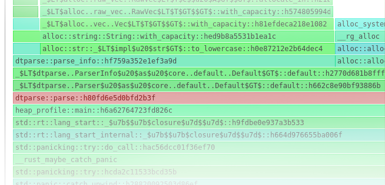
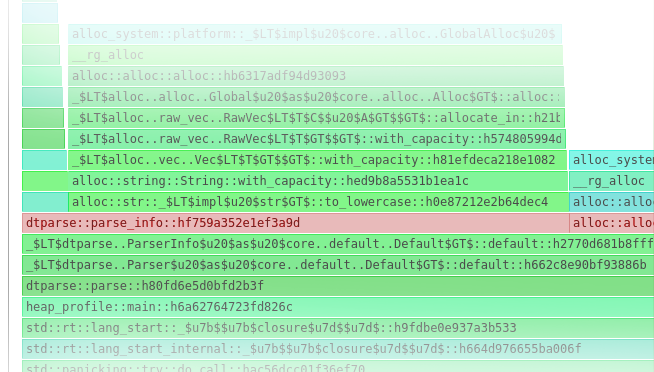
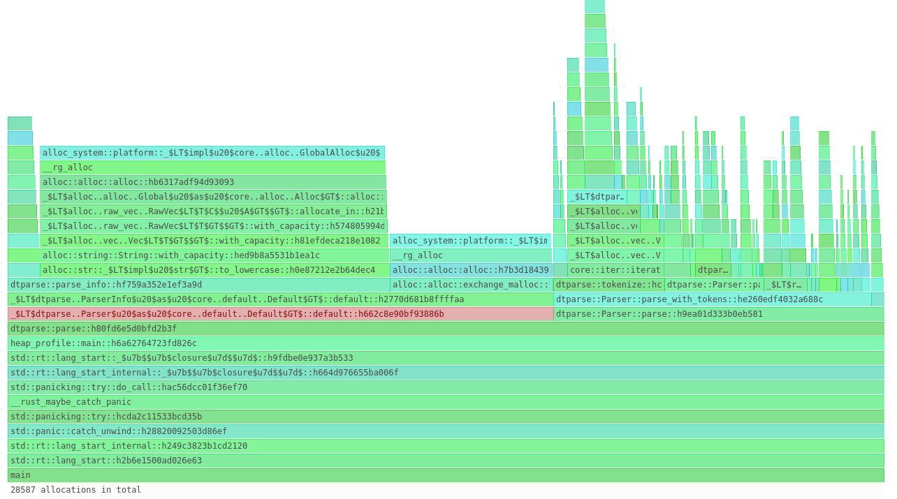
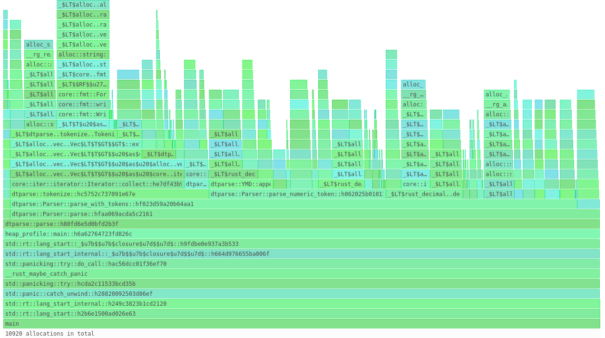
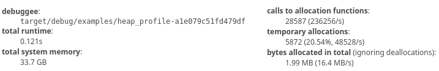
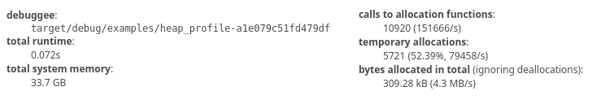

I remember early in my career someone joking that:

> Programmers have it too easy these days. They should learn to develop in low memory environments
> and be more efficient.

...though it's not like the first code I wrote was for a
[graphing calculator](https://web.archive.org/web/20180924060530/https://education.ti.com/en/products/calculators/graphing-calculators/ti-84-plus-se)
packing a whole 24KB of RAM.

But the principle remains: be efficient with the resources you have, because
[what Intel giveth, Microsoft taketh away](http://exo-blog.blogspot.com/2007/09/what-intel-giveth-microsoft-taketh-away.html).

<!-- truncate -->

My professional work is focused on this kind of efficiency; low-latency financial markets demand
that you understand at a deep level _exactly_ what your code is doing. As I continue experimenting
with Rust for personal projects, it's exciting to bring a utilitarian mindset with me: there's
flexibility for the times I pretend to have a garbage collector, and flexibility for the times that
I really care about how memory is used.

This post is a (small) case study in how I went from the former to the latter. And ultimately, it's
intended to be a starting toolkit to empower analysis of your own code.

## Curiosity

When I first started building the [dtparse] crate, my intention was to mirror as closely as possible
the equivalent [Python library][dateutil]. Python, as you may know, is garbage collected. Very
rarely is memory usage considered in Python, and I likewise wasn't paying too much attention when
`dtparse` was first being built.

This lackadaisical approach to memory works well enough, and I'm not planning on making `dtparse`
hyper-efficient. But every so often, I've wondered: "what exactly is going on in memory?" With the
advent of Rust 1.28 and the
[Global Allocator trait](https://doc.rust-lang.org/std/alloc/trait.GlobalAlloc.html), I had a really
great idea: _build a custom allocator that allows you to track your own allocations._ That way, you
can do things like writing tests for both correct results and correct memory usage. I gave it a
[shot][qadapt], but learned very quickly: **never write your own allocator**. It went from "fun
weekend project" to "I have literally no idea what my computer is doing" at breakneck speed.

Instead, I'll highlight a separate path I took to make sense of my memory usage: [heaptrack].

## Turning on the System Allocator

This is the hardest part of the post. Because Rust uses
[its own allocator](https://github.com/rust-lang/rust/pull/27400#issue-41256384) by default,
`heaptrack` is unable to properly record unmodified Rust code. To remedy this, we'll make use of the
`#[global_allocator]` attribute.

Specifically, in `lib.rs` or `main.rs`, add this:

```rust
use std::alloc::System;

#[global_allocator]
static GLOBAL: System = System;
```

...and that's it. Everything else comes essentially for free.

## Running heaptrack

Assuming you've installed heaptrack <small>(Homebrew in Mac, package manager
in Linux, ??? in Windows)</small>, all that's left is to fire up your application:

```
heaptrack my_application
```

It's that easy. After the program finishes, you'll see a file in your local directory with a name
like `heaptrack.my_appplication.XXXX.gz`. If you load that up in `heaptrack_gui`, you'll see
something like this:



---

And even these pretty colors:



## Reading Flamegraphs

To make sense of our memory usage, we're going to focus on that last picture - it's called a
["flamegraph"](http://www.brendangregg.com/flamegraphs.html). These charts are typically used to
show how much time your program spends executing each function, but they're used here to show how
much memory was allocated during those functions instead.

For example, we can see that all executions happened during the `main` function:



...and within that, all allocations happened during `dtparse::parse`:



...and within _that_, allocations happened in two different places:



Now I apologize that it's hard to see, but there's one area specifically that stuck out as an issue:
**what the heck is the `Default` thing doing?**



## Optimizing dtparse

See, I knew that there were some allocations during calls to `dtparse::parse`, but I was totally
wrong about where the bulk of allocations occurred in my program. Let me post the code and see if
you can spot the mistake:

```rust
/// Main entry point for using `dtparse`.
pub fn parse(timestr: &str) -> ParseResult<(NaiveDateTime, Option<FixedOffset>)> {
    let res = Parser::default().parse(
        timestr, None, None, false, false,
        None, false,
        &HashMap::new(),
    )?;

    Ok((res.0, res.1))
}
```

> [dtparse](https://github.com/bspeice/dtparse/blob/4d7c5dd99572823fa4a390b483c38ab020a2172f/src/lib.rs#L1286)

---

Because `Parser::parse` requires a mutable reference to itself, I have to create a new
`Parser::default` every time it receives a string. This is excessive! We'd rather have an immutable
parser that can be re-used, and avoid allocating memory in the first place.

Armed with that information, I put some time in to
[make the parser immutable](https://github.com/bspeice/dtparse/commit/741afa34517d6bc1155713bbc5d66905fea13fad#diff-b4aea3e418ccdb71239b96952d9cddb6).
Now that I can re-use the same parser over and over, the allocations disappear:



In total, we went from requiring 2 MB of memory in
[version 1.0.2](https://crates.io/crates/dtparse/1.0.2):



All the way down to 300KB in [version 1.0.3](https://crates.io/crates/dtparse/1.0.3):



## Conclusion

In the end, you don't need to write a custom allocator to be efficient with memory, great tools
already exist to help you understand what your program is doing.

**Use them.**

Given that [Moore's Law](https://en.wikipedia.org/wiki/Moore%27s_law) is
[dead](https://www.technologyreview.com/s/601441/moores-law-is-dead-now-what/), we've all got to do
our part to take back what Microsoft stole.

[dtparse]: https://crates.io/crates/dtparse
[dateutil]: https://github.com/dateutil/dateutil
[heaptrack]: https://github.com/KDE/heaptrack
[qadapt]: https://crates.io/crates/qadapt
