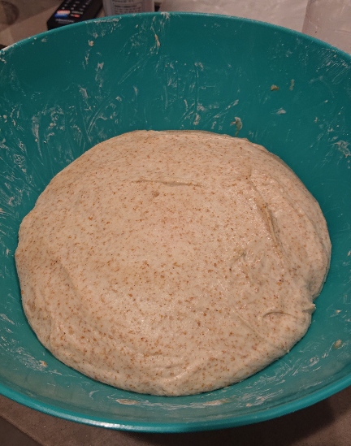
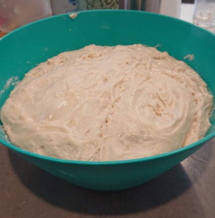
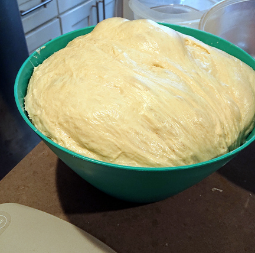
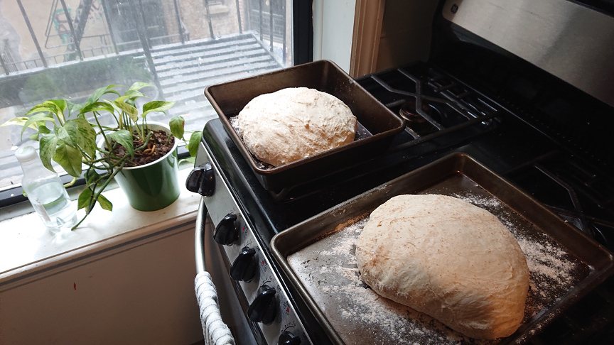
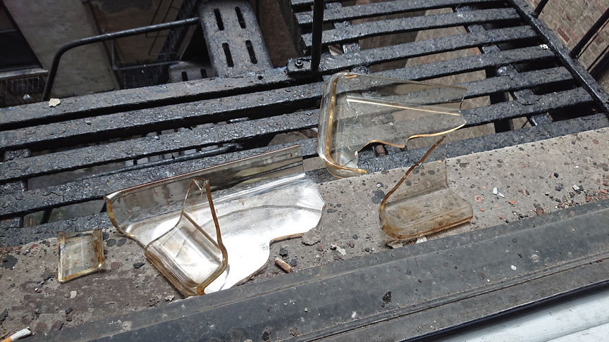
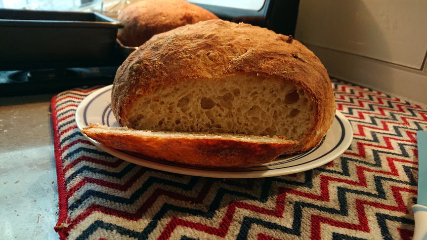

Having recently started my "gardening leave" between positions, I have some more personal time
available. I'm planning to stay productive, contributing to some open-source projects, but it also
occurred to me that despite [talking about](https://speice.io/2018/05/hello.html) bread pics, this
blog has been purely technical. Maybe I'll change the site title from "The Old Speice Guy" to "Bites
and Bytes"?

<!-- truncate -->

Either way, I'm baking a little bit again, and figured it was worth taking a quick break to focus on
some lighter material. I recently learned two critically important lessons: first, the temperature
of the dough when you put the yeast in makes a huge difference.

Previously, when I wasn't paying attention to dough temperature:

Compared with what happens when I put the dough in the microwave for a defrost cycle because the
water I used wasn't warm enough:

I mean, just look at the bubbles!

After shaping the dough, I've got two loaves ready:

Now, the recipe normally calls for a Dutch Oven to bake the bread because it keeps the dough from
drying out in the oven. Because I don't own a Dutch Oven, I typically put a casserole dish on the
bottom rack and fill it with water so there's still some moisture in the oven. This time, I forgot
to add the water and learned my second lesson: never add room-temperature water to a glass dish
that's currently at 500 degrees.

Needless to say, trying to pull out sharp glass from an incredibly hot oven is not what I expected
to be doing during my garden leave.

In the end, the bread crust wasn't great, but the bread itself turned out pretty alright:

I've been writing a lot more during this break, so I'm looking forward to sharing that in the
future. In the mean-time, I'm planning on making a sandwich.
