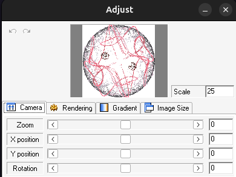

Something that bugged me while writing the first three articles on fractal flames were the constraints on
output images. At the time, I had worked out how to render fractal flames by studying
 [Apophysis](https://sourceforge.net/projects/apophysis/) and [flam3](https://github.com/scottdraves/flam3); just enough to display images
in a browser.

Having spent more time with fractal flames and computer graphics, it's time to implement
some missing features.

<!-- truncate -->

## Restrictions

To review, the restrictions we've had so far:

> ...we need to convert from fractal flame coordinates to pixel coordinates.
> To simplify things, we'll assume that we're plotting a square image with range $[0,1]$ for both x and y
>
> -- [The fractal flame algorithm](/2024/11/playing-with-fire)

First, we've assumed that fractals get displayed in a square image. Ignoring aspect ratios simplifies
the render process, but we don't usually want square images. It's possible to render a large
square image and crop it to fit, but we'd rather render directly to the desired size.

Second, we've assumed that fractals have a pre-determined display range. For Sierpinski's Gasket,
that was $[0, 1]$ (the reference parameters used a range of $[-2, 2]$). However, if we could
control the display range, it would let us zoom in and out of the image.

## Parameters

For comparison, the camera controls available in Apophysis offer a lot of flexibility:

<center></center>

The remaining parameters to implement are: position (X and Y), rotation, zoom, and scale.

### Position

Fractal flames normally use $(0, 0)$ as the image center. The position parameters (X and Y) move
the center point, which effectively pans the image. A positive X position shifts left, and a
negative X position shifts right. Similarly, a positive Y position shifts up, and a negative
Y position shifts the image down.

To apply the position parameters, simply subtract them from each point in the chaos game prior to plotting it:

```typescript
[x, y] = [
  x - positionX,
  y - positionY
];
```

### Rotation

After the position parameters, we can rotate the image around the (new) center point. To do so, we'll go back to the
[affine transformations](https://en.wikipedia.org/wiki/Affine_transformation) we've been using so far.
Specifically, the rotation angle $\theta$ gives us a transform matrix we can apply prior to plotting:

$$
\begin{bmatrix}
\text{cos}(\theta) & -\text{sin}(\theta) \\
\text{sin}(\theta) & \text{cos}(\theta)
\end{bmatrix}

\begin{bmatrix}
x \\
y
\end{bmatrix}
$$


```typescript
[x, y] = [
  x * Math.cos(-rotate) -
  y * Math.sin(-rotate),
  x * Math.sin(-rotate) +
  y * Math.cos(-rotate),
];
```

:::note
To match the behavior of Apophysis/`flam3`, we need to negate the rotation angle.
:::

### Zoom

This parameter does what the name implies; zoom in and out of the image. To do this, we multiply
the X and Y coordinates of each point by a zoom factor. For a zoom parameter $z$, the zoom factor
will be $\text{pow}(2, z)$.

For example, if the current point is $(1, 1)$, a zoom parameter of 1 means we actually plot $(1, 1) \cdot \text{pow}(2, 1) = (2, 2)$.

```
[x, y] = [
  x * Math.pow(2, zoom),
  y * Math.pow(2, zoom)
];
```

:::info
In addition to scaling the image, renderers also [scale the image quality](https://github.com/scottdraves/flam3/blob/f8b6c782012e4d922ef2cc2f0c2686b612c32504/rect.c#L796-L797)
to compensate for the reduced display range.
:::

### Scale

Finally, we need to convert from fractal flame coordinates to individual pixels. The scale parameter defines
how many pixels are in one unit of the fractal flame coordinate system, which gives us a mapping from one system
to the other.

If you open the [reference parameters](../params.flame) in a text editor, you'll see the following:

```xml
<flame name="final xform" size="600 600" center="0 0" scale="150">
```

Here's what each element means:

- `size="600 600"`: The image should be 600 pixels wide and 600 pixels tall
- `center="0 0"`: The image is centered at the point $(0, 0)$
- `scale="150"`: The image has 150 pixels per unit

Let's break it down. Dividing the image width (600) by the image scale (150) gives us a value of 4.
This means the image should be 4 units wide (same for the height). Because the center is at $(0, 0)$,
the final image is effectively using the range $[-2, 2]$ in fractal coordinates.

Now, to go from fractal coordinates to pixel coordinates we multiply by the scale,
then subtract half the image width and height:

```typescript
[pixelX, pixelY] = [
  x * scale - imageWidth / 2,
  y * scale - imageHeight / 2
]
```

Scale and zoom have similar effects on images. If the reference parameters used `scale="300"`,
the same 600 pixels would instead be looking at the range $[-1, 1]$ in the fractal coordinate system.
Using `zoom="1"` would accomplish the same result.

However, this also demonstrates the biggest problem with using scale: it only controls the output image.
For example, if the output image changed to `size="1200 1200"` and we kept `scale="150"`, it would
have a display range of $[-4, 4]$. There would be a lot of extra white space. Because the zoom parameter
has the same effect regardless of output image size, it is the preferred way to zoom in and out.

:::info
One final note about the camera controls: every step in this process (position, rotation, zoom, scale)
is an affine transformation. And because affine transformations can be chained together, it's possible to
express all the camera controls as a single transformation matrix. This is important for software optimization;
rather than applying parameters step-by-step, we can apply all of them at once.

They could also be implemented as part of the final transform, but in practice, it's helpful
to control them separately.
:::

## Camera

With the individual steps defined, we can put together a more robust "camera" for viewing the fractal flame.

import CodeBlock from "@theme/CodeBlock";
import cameraSource from "!!raw-loader!./camera"

<CodeBlock language="typescript">{cameraSource}</CodeBlock>

To demonstrate, this display has a 4:3 aspect ratio, removing the restriction of a square image.
In addition, the scale is automatically chosen so the image width covers the range $[-2, 2]$.
Because of the 4:3 aspect ratio, the image height now covers the range $[-1.5, 1.5]$.

import {SquareCanvas} from "../src/Canvas";
import FlameCamera from "./FlameCamera";

<SquareCanvas name={"flame_camera"} width={'95%'} aspectRatio={'4/3'}><FlameCamera /></SquareCanvas>

## Summary

The previous fractal images relied on assumptions about the output format to make sure they looked correct.
Now, we have much more control. We can implement a 2D "camera" as a series of affine transformations, going from
fractal flame coordinates to pixel coordinates.

More recent fractal flame renderers like [Fractorium](http://fractorium.com/) can also operate in 3D,
and have to implement a more complex camera system to handle the extra dimension.

But for this blog series, it's nice to achieve feature parity with the reference implementation.